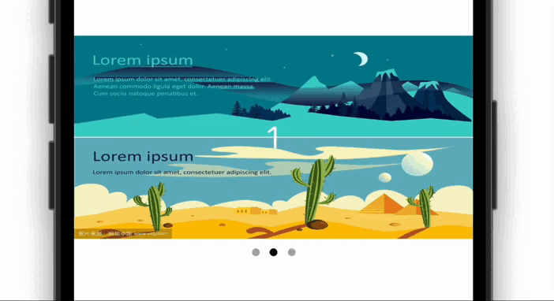

# AutoCycleBanner

一个可以自动无限滚动的 Banner 视图。



## 引入

```
pod 'AutoCycleBanner'
```

## 用法

### 示例

```swift
let banner = AutoCycleBanner()
banner.pageControl = pageControl
banner.imageUrls = [
    "xxxx",
    "xxxx",
    "xxxx
]
banner.didTapIndex = {
    print($0)
}
banner.scrollInterval = 3
addSubview(banner)

// 布局代码
```

### 设置图片数据

```swift
banner.imageUrls = [
    "https://t7.baidu.com/it/u=963301259,1982396977&fm=193&f=GIF",
    "https://t7.baidu.com/it/u=1575628574,1150213623&fm=193&f=GIF",
    "https://t7.baidu.com/it/u=737555197,308540855&fm=193&f=GIF"
]
```

### 设置点击事件

```swift
banner.didTapIndex = {
    print($0)
}
```

### 自定义 PageControl

```swift
let pageControl: UIPageControl = {
    let pageControl = UIPageControl(frame: CGRect(x: 0, y: 0, width: 80, height: 30))
    pageControl.currentPageIndicatorTintColor = .black
    pageControl.pageIndicatorTintColor = .lightGray
    return pageControl
}()

addSubview(pageControl) // 需要调用 addSubview 来添加自己的 pageControl，因为如果 pageControl 位于 banner 的外部，banner 如果设置了 maskToBounds 后 pageControl 会不可见
banner.pageControl = pageControl
```

设置 `banner.pageControl` 属性后，自定义的 pageControl 即可以和 banner 联动。

### 自定义图片占位图

```swift
banner.placeholderImage = UIImage(named: "xxxxx)
```

### 设置滚动间隔时间

```swift
banner.scrollInterval = 5
```

### 控制滚动的开始和停止

默认滚动是自动开始的，可以通过以下方法来控制：

#### 开始

```
banner.startScrolling()
```

#### 停止

```
banner.endScrolling()
```

